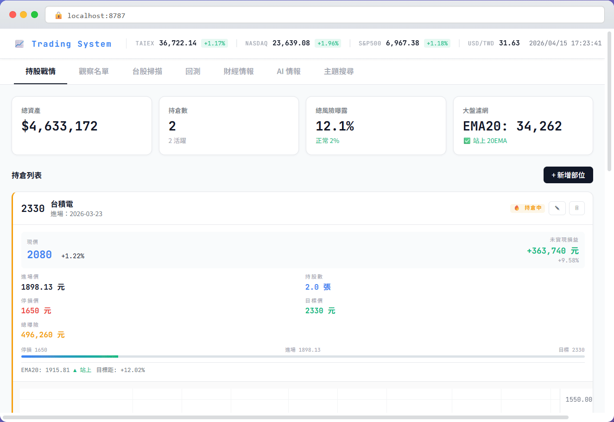
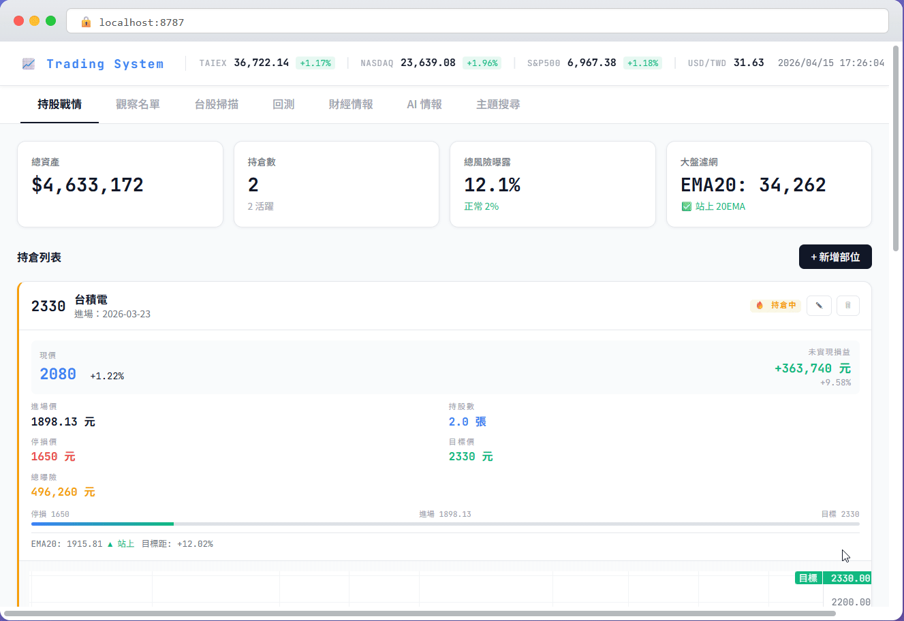
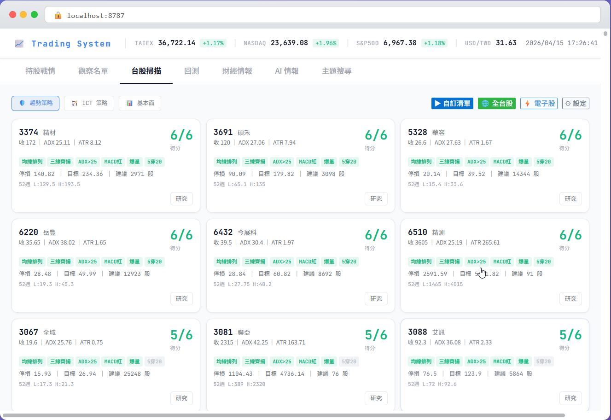
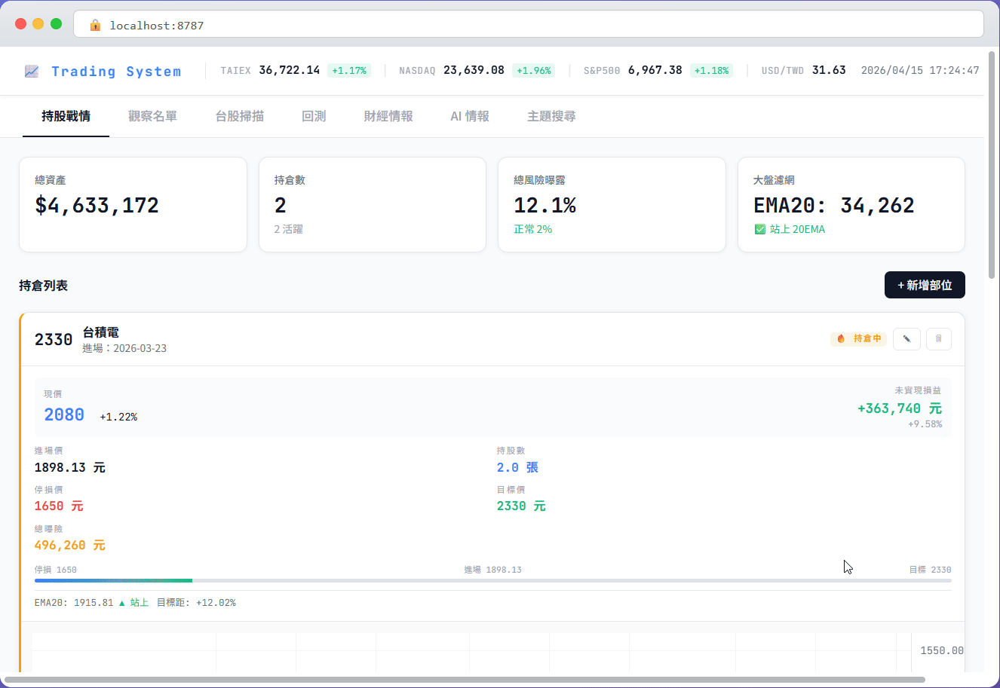

# Trading System

台股技術分析 + 基本面交易管理系統，整合 Web 儀表板、Telegram Bot 與自動推播排程。

- 38+ API 端點 · 7 Blueprint 模組
- 3 大策略（趨勢 / ICT / 基本面）
- 全市場 1800+ 檔即時掃描
- OHLCV 本地快取 + 2PM 新鮮度機制
- 444 個單元測試

`Flask` `Lightweight Charts` `Chart.js` `Groq API` `SQLite` `Telegram Bot`

---

## 📊 持股戰情

即時持倉儀表板 — 摘要卡片 + 每筆持倉內嵌日線 K 線圖。



- 4 欄摘要：總資產 / 持倉數 / 風險曝露 / 大盤 20EMA 濾網
- 日線 K 線圖：EMA5（橘）/ EMA20（藍）/ EMA60（紫）+ 停損 / 進場 / 目標線 + Swing Low
- 即時報價更新（OHLCV DB 快取）
- 新增 / 編輯 / 刪除持倉，代號自動查詢

---

## 🔍 台股掃描

三大策略全市場掃描，篩出高分進場候選。



- **趨勢策略**（6 信號）：均線排列 / 三線齊揚 / ADX / MACD / 爆量 / 黃金交叉
- **ICT 策略**（7 信號）：Order Block / FVG / BOS / 流動性掃除 / 折扣區 / OTE / MSS
- **基本面策略**（5 信號）：PE / EPS / EPS 成長 / PB / 營收成長
- 全市場 SSE 串流掃描（1800+ 檔）+ 電子股篩選
- 個股研究摘要（Markdown 渲染 + 供應鏈連結可點擊搜尋）

---

## 🔬 回測系統

Walk-forward 回測引擎，嚴格防止未來資訊洩漏。



- 單檔 / 多檔比較 / 全市場批次回測
- 手續費（0.1425%）+ 滑價（0.05%）模型
- Monte Carlo 信心區間（p5 / p50 / p95 淡色帶）
- 資產曲線 + 交易記錄 + CSV 匯出
- 策略參數掃描（Grid Search，SSE 串流）

---

## 🤖 AI 情報

Groq（Llama 3.3）驅動的市場情報分析系統。


- AI 市場情緒分析（Bullish / Bearish / Neutral 評分）
- X/Twitter 市場討論監控（Groq + Google News 三層 fallback）
- 每日 AI 情報摘要（08:00 自動生成）
- 未設定 `GROQ_API_KEY` 時自動降級

---

## 💬 Telegram Bot

與 Web 功能完全對齊，34 個指令，隨時隨地掌握市場。

<!-- Telegram Bot 無 GIF，使用文字說明 -->

- 持倉 / 大盤 / 新聞 / 掃描 / 回測 / AI 情報
- 盤前早報（08:30）/ 收盤報告（13:30）自動推播
- 觀察名單雙策略分析

---

## 📋 觀察名單

追蹤感興趣的股票，趨勢 + 基本面雙策略分析一鍵完成。



- 新增 / 移除觀察股票
- 趨勢策略 + 基本面策略雙重分析（ADX / MACD / EMA / PE / EPS / PB / 營收成長）
- Google News 即時新聞
- 5 分鐘快取，避免重複請求

---

## 📰 財經情報

RSS 即時財經新聞聚合，自動分類標籤。

<!-- 財經情報包含在 AI 情報 GIF 中 -->

- 鉅亨網 / Yahoo 財經 / 工商時報 / 中央社
- 自動分類：台股 / 國際 / 總經
- 即時更新

---

## 🔎 主題搜尋

200+ 熱門關鍵字雲，點擊即時搜尋相關台股。


- 關鍵字雲：CoWoS / AI 伺服器 / 電動車 / 5G / PCB ...
- 點擊關鍵字即時搜尋相關台股
- 個股研究摘要：業務概況 / 供應鏈 / 主要客戶 / 相關標的（Markdown 渲染）

---

### 📈 大盤即時行情
導航列即時顯示 TAIEX / NASDAQ / S&P500 / USD-TWD + 大盤 20EMA 濾網。

---

## 技術架構

| 層 | 技術 |
|----|------|
| 前端 | Vanilla JS + Lightweight Charts + Chart.js（淺色 SaaS 風格） |
| 後端 | Flask + 7 Blueprint API 模組 |
| 資料庫 | SQLite × 3（positions.db / intelligence.db / ohlcv_cache.db） |
| AI | Groq REST API（Llama 3.3） |
| 資料來源 | TWSE / TPEX 官方 API + yfinance + RSS |
| Bot | Telegram Bot API |

---

## 專案結構

```
trading_system/
├── run.py                      # 啟動入口
├── app.py                      # Flask 應用
├── index.html                  # 前端 HTML 骨架
├── static/
│   ├── css/main.css            # 全域 CSS（淺色 SaaS 主題）
│   └── js/                     # 9 個模組化 JS 檔案
├── trading/
│   ├── api/                    # 7 個 Flask Blueprint
│   ├── services/container.py   # 服務容器（lazy-init 單例）
│   ├── strategies/             # 趨勢 / ICT / 基本面策略
│   ├── telegram/               # Telegram Bot + 排程器
│   └── ...                     # 其他服務模組
└── tests/                      # 444 個單元測試
```

---

## 安裝與啟動

```bash
pip install -r requirements.txt
cp .env.example .env
python run.py
```

| 環境變數 | 說明 |
|---------|------|
| `TELEGRAM_BOT_TOKEN` | Telegram Bot Token（選填） |
| `TELEGRAM_ALLOWED_IDS` | 允許的 Chat ID（選填） |
| `GROQ_API_KEY` | Groq API Key — AI 情報功能（選填） |

瀏覽器自動開啟 `http://localhost:8787`。

---

## Telegram 指令速查

| 類別 | 指令 |
|------|------|
| 持倉 | `/pos` `/report` `/risk` `/stats` `/addpos` `/delpos` |
| 市場 | `/market` `/filter` `/news` `/analyze` `/ict` `/fund` `/size` |
| 掃描 | `/scan` `/scanall` `/scanict` `/watchlist` `/wadd` `/wdel` |
| 觀察 | `/wlist` `/wladd` `/wldel` `/wlscan` |
| 回測 | `/backtest` `/backtestall` |
| AI | `/ai` `/x` `/summary` |
| 系統 | `/strategy` `/schedule` `/testam` `/testpm` `/help` |

---

## 環境需求

- Python 3.10+
- 相依套件見 `requirements.txt`

## 免責說明

> **本專案僅供研究與學習用途，不構成任何形式的投資建議。**
>
> 所有技術指標、策略信號、回測結果及 AI 情緒分析均基於歷史數據的統計呈現，不代表對未來市場走勢的預測或保證。歷史報酬不等於未來績效，情緒指標反映的是過去的統計規律，無法保證未來重現相同結果。
>
> 使用者不應將本系統的任何輸出作為實際投資決策的唯一依據。投資涉及風險，可能導致本金損失，請自行評估個人風險承受能力，並在做出任何投資決定前諮詢合格的專業財務顧問。

## License

MIT
